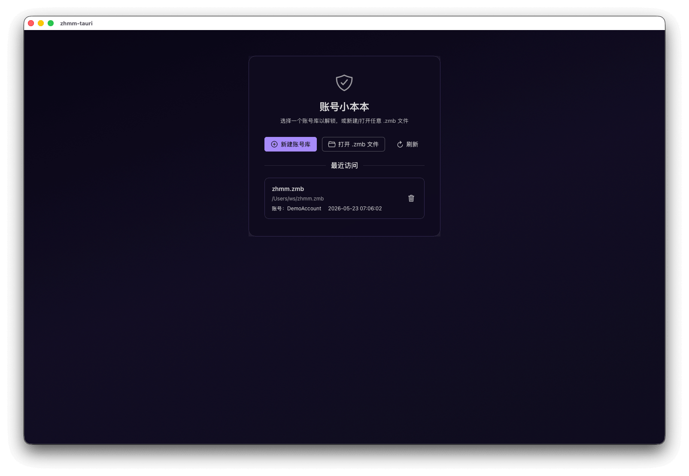
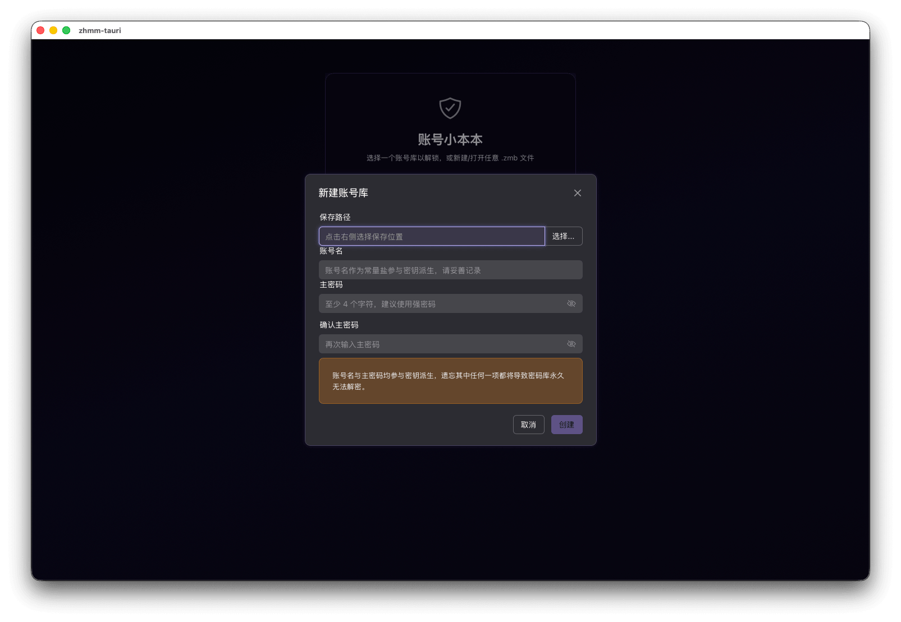
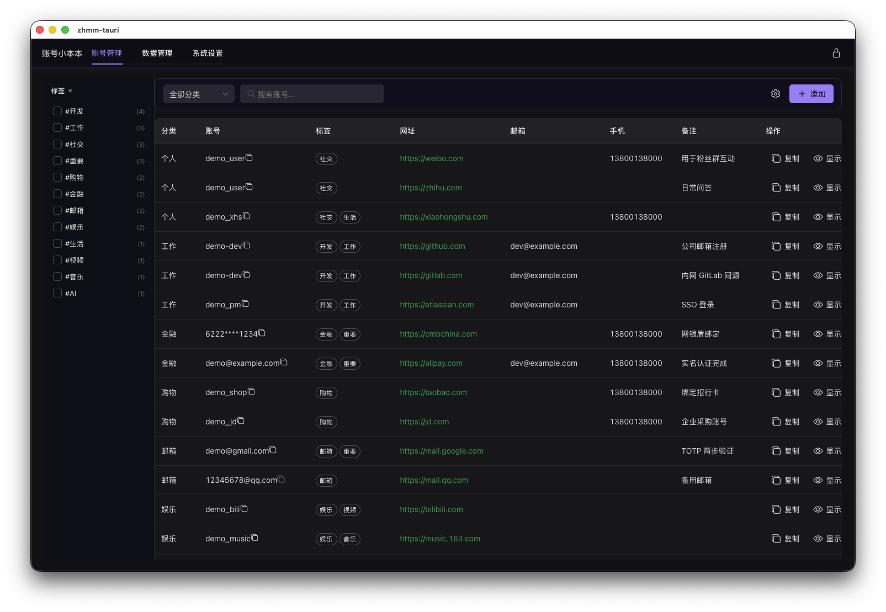
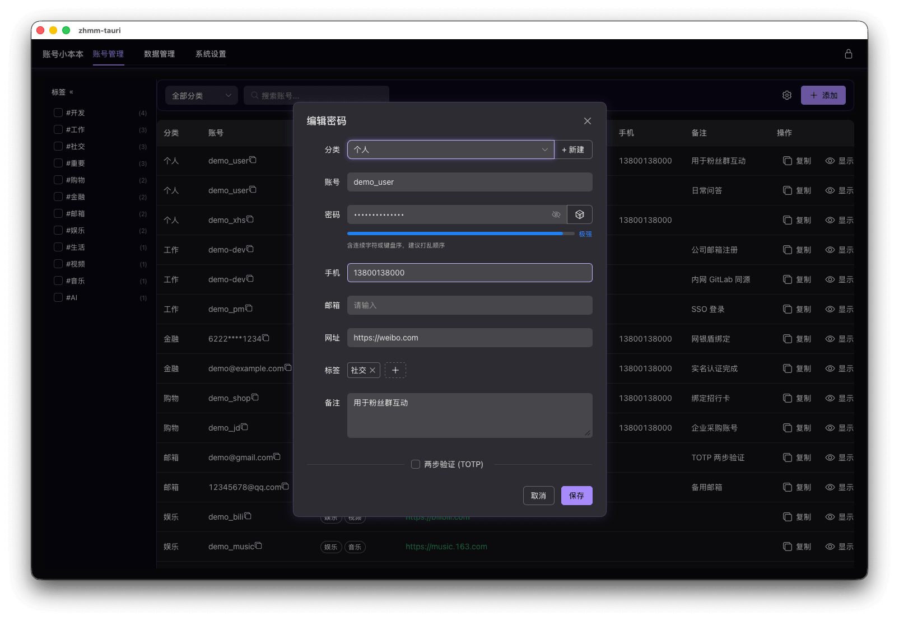
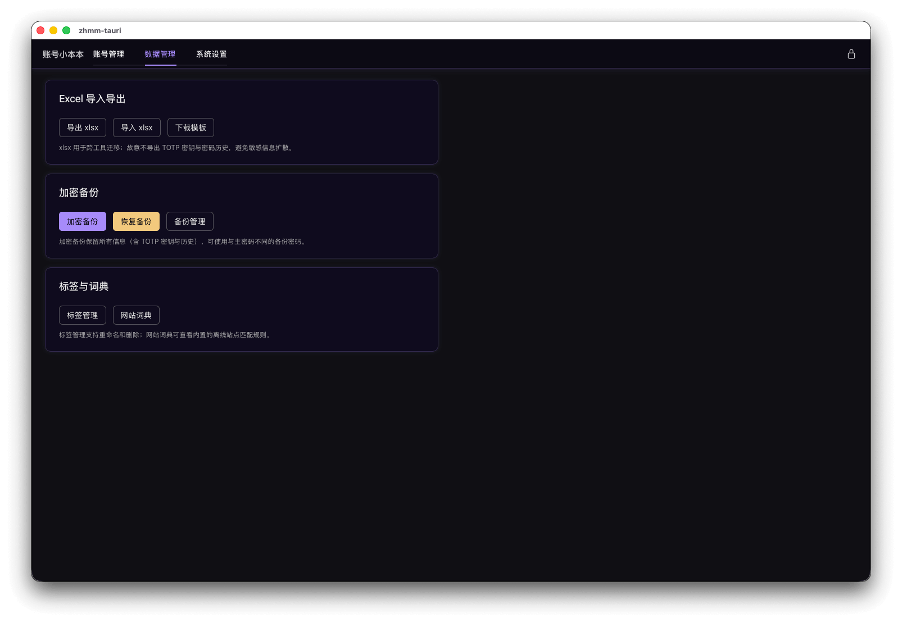
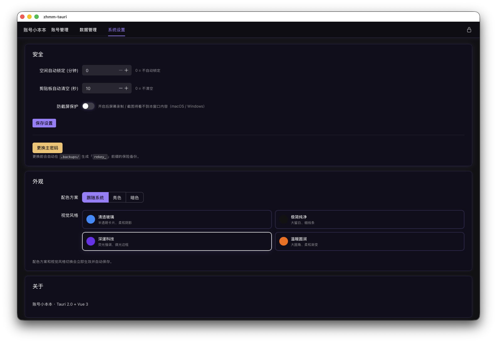

<h1 align="center">🔐 zhmm-tauri</h1>

<p align="center">
  基于 <b>国密算法（SM3 / SM4）</b> 的本地优先账号密码管理器（Tauri + Vue 3 + Rust 实现）<br/>
  与 <a href="https://github.com/szgenle/zhmm">Python 版 zhmm</a> 共享同一套 <code>.zmb</code> 密库格式，可双向打开互通。
</p>

<p align="center">
  <a href="https://github.com/szgenle/zhmm-tauri/actions"></a>
  <a href="https://github.com/szgenle/zhmm-tauri/releases"></a>
  <a href="https://tauri.app/"></a>
  <a href="https://vuejs.org/"></a>
  <a href="https://www.rust-lang.org/"></a>
  <a href="LICENSE"></a>
</p>

---

## 📖 关于本项目

`zhmm-tauri` 是 [zhmm](https://github.com/szgenle/zhmm)（PyQt6 实现）的 **跨平台桌面客户端重构版**：

- 🦀 **后端**：Rust + Tauri 2.x，加密/序列化/IO 在原生层完成，体积小、启动快
- 🖼 **前端**：Vue 3 + TypeScript + Naive UI，组件化页面 + 自定义主题
- 🔄 **完全互通**：与 Python 版共享同一套 `.zmb` 密库格式（v6 = SM4-GCM；v5 仅读，自动升级 v6），双方互相打开同一个文件

> ⚠️ 项目仍在持续迭代中，暂未发布正式版二进制；欢迎从源码体验、提 Issue 与 PR。

---

## ✨ 特性

- 🔒 **国密加密栈**：Argon2id（默认 `m=64 MiB, t=3, p=1`，账号 + 主密码双因子）派生 SM4 密钥 → **SM4-GCM 原生 AEAD**（CTR 流加密 + GHASH 认证，header 含 Argon2 参数整体作为 AAD）；密钥永不落盘
- 📦 **单文件密库**：一个 `.zmb` 文件即完整密库（v6 二进制格式：magic + 版本号 + Argon2 参数 + salt + iv + 密文 + 认证标签）
- 🤝 **与 Python 版互通**：Python 版 `zhmm` 创建的 `.zmb` 文件可直接在本应用打开；本应用保存的文件也可被 Python 版读取
- 🔓 **历史版本兼容**：可读取 v5 旧格式（SM4-CBC + HMAC-SM3），下次保存自动升级到 v6
- 🏷 **多账号库 + 分类（role） + 标签**：支持同时管理多个 `.zmb` 文件，条目可按 role 维度筛选 + 0~16 个标签 AND 语义筛选
- 🌐 **网址自动打标签**：随包发行的离线词典（约 400 条中文常用站点），URL 失焦时自动识别并建议标签；纯离线、不联网
- 🔐 **TOTP 2FA**：内置动态口令（RFC 6238 SHA1/SHA256/SHA512 + 国密 SM3-TOTP 扩展），支持 `otpauth://` URI 解析与 Base32 手动粘贴
- 🕘 **密码历史**：每条目自动保留最近 5 次旧密码，可在编辑界面查看 / 复制 / 一键回滚
- 📊 **密码强度可视化**：纯离线启发式评估，登录、新增、随机生成、换主密码界面均内嵌实时强度条
- 📝 **Excel 导入导出**：支持 xlsx 导入导出（导出自动剔除 TOTP Secret 与历史密码，仅 `.zmb` 加密备份完整保留）
- 🔑 **主密码原地更换**：内部先自动备份再原地落盘，无需导出/重导入
- 💾 **本地备份管理**：在密库同目录下维护 `.backups/` 子目录，支持创建 / 列出 / 恢复 / 清理
- 🎨 **可切换主题**：内置 Cyberpunk / Glass / Minimal / Warm 四套预设，可在「设置」中切换
- 🪟 **窗口状态记忆**：自动记忆窗口位置与尺寸

---

## 📸 界面截图

> 当前界面仅提供中文版（i18n 未来视需求再考虑）。

<table>
  <tr>
    <td align="center" width="50%">
      <br/>
      <sub><b>首页：已添加的账号库列表</b></sub>
    </td>
    <td align="center" width="50%">
      <br/>
      <sub><b>新建账号库</b></sub>
    </td>
  </tr>
  <tr>
    <td align="center" width="50%">
      <br/>
      <sub><b>主界面：密码列表 + 标签筛选</b></sub>
    </td>
    <td align="center" width="50%">
      <br/>
      <sub><b>新增 / 编辑条目（含 TOTP、强度条）</b></sub>
    </td>
  </tr>
  <tr>
    <td align="center" width="50%">
      <br/>
      <sub><b>数据管理：导入导出 / 标签 / 备份</b></sub>
    </td>
    <td align="center" width="50%">
      <br/>
      <sub><b>设置：主题 / 自动锁定 / 主密码</b></sub>
    </td>
  </tr>
</table>

---

## 📦 安装与运行

### 从源码运行（开发者推荐）

依赖：

- [Node.js](https://nodejs.org/) ≥ 18
- [Rust](https://www.rust-lang.org/tools/install) ≥ 1.77（含 `cargo`）
- 平台依赖详见 [Tauri 官方先决条件](https://tauri.app/start/prerequisites/)

```bash
git clone https://github.com/szgenle/zhmm-tauri.git
cd zhmm-tauri

make install        # 安装前端 + Rust 依赖
make dev            # 启动开发模式（热更新）
make build          # 打包生产版本，产物位于 src-tauri/target/release/bundle/
```

或不使用 Make：

```bash
npm install
npm run tauri dev
npm run tauri build
```

### 从 Release 下载预编译包

稳定版发布后，可在 [Releases](https://github.com/szgenle/zhmm-tauri/releases) 页面下载对应平台安装包：

- macOS：`.dmg` / `.app.tar.gz`
- Windows：`.msi` / `.exe`
- Linux：`.AppImage` / `.deb`

---

## 🚀 快速开始

1. 启动应用，首次使用点击「新建账号库」，选择保存位置（`.zmb` 文件）
2. 输入 **账号名**（任意稳定唯一标识，如邮箱、手机号；会作为 KDF 常量盐参与密钥派生）和 **主密码**
3. 进入主界面后即可新增条目（站点 / 账号 / 密码 / TOTP / 备注 / 标签）
4. 在「设置」中可切换主题、配置自动锁定、更换主密码
5. 在「数据管理」中可导入导出 Excel、管理标签、查看网站词典、维护本地备份

> 💡 已有 Python 版 `zhmm` 的用户可直接「打开账号库」选择原有 `.zmb` 文件，账号名 + 主密码与原版一致即可。

### 🧪 试用 Demo 数据

仓库提供了一份可直接导入的示例表格：[`docs/demo_data.xlsx`](docs/demo_data.xlsx)。

- **性质**：纯**虚构示例数据**，不包含任何真实账号 / 密码，可放心导入测试
- **列格式**：13 列，与 [`src-tauri/src/io_xlsx.rs`](src-tauri/src/io_xlsx.rs) 中 `CN_HEADS` 完全一致，也与 Python 版 `zhmm` 的导出格式互通：
  > `ID | 类别 | 账号 | 密码 | 手机 | 邮箱 | 网站 | 备注 | 更新时间 | TOTP算法 | TOTP位数 | TOTP周期 | 标签`
- **导入路径**：主界面 →「数据管理」→「从 Excel 导入」→ 选择 `docs/demo_data.xlsx`

导入后可用于体验标签筛选、TOTP 显示、密码强度条、Excel 导出、备份恢复等完整功能。

---

## 🏗 项目结构

```
zhmm-tauri/
├── src/                       # 前端：Vue 3 + TypeScript
│   ├── views/                 # 页面（PasswordList / DataManagement / Settings / FileList）
│   ├── components/            # 业务组件（Dialog / TagSidebar / TotpCell / 强度条 …）
│   ├── composables/           # Composition API 复用逻辑
│   ├── layouts/               # MainLayout 等布局
│   ├── router/                # vue-router 路由配置
│   ├── themes/                # 主题预设：cyberpunk / glass / minimal / warm
│   ├── api.ts                 # 封装 Tauri invoke 调用
│   └── settings.ts            # 应用设置
├── src-tauri/                 # 后端：Rust + Tauri
│   ├── src/
│   │   ├── crypto.rs          # Argon2id + SM4-GCM（v6）/ SM4-CBC + HMAC-SM3（v5 兼容读）
│   │   ├── vault.rs           # 密码库状态、加解密、备份、rekey
│   │   ├── accounts.rs        # 多账号库与最近文件索引
│   │   ├── commands.rs        # Tauri command 入口
│   │   ├── models.rs          # 数据模型与序列化
│   │   ├── io_json.rs         # JSON 持久化
│   │   ├── io_xlsx.rs         # Excel 导入导出（calamine + rust_xlsxwriter）
│   │   ├── totp.rs            # TOTP（RFC 6238 + SM3 扩展）
│   │   ├── site_catalog.rs    # 离线网站词典
│   │   ├── settings.rs        # 应用配置
│   │   ├── anti_capture.rs    # 防截屏（macOS / Windows）
│   │   └── errors.rs
│   ├── Cargo.toml
│   └── tauri.conf.json
├── resources/site_catalog.json # 离线网站词典（约 400 条）
└── Makefile                   # 常用命令封装
```

### 🔐 加密设计（`.zmb` 文件 v6 格式）

| 环节 | 算法 | 参数 |
|------|------|------|
| 密钥派生 | **Argon2id**（memory-hard） | 默认 `m=64 MiB, t=3, p=1`，16 字节随机盐；KDF 口令材料 `account.utf8 ‖ 0x00 ‖ password.utf8` |
| 加密 + 认证 | **SM4-GCM** | 12 字节随机 IV，CTR 流加密 + GHASH 认证，header（含 Argon2 参数）作为 AAD 整体保护，16 字节认证标签 |

文件布局（v6）：

```
magic(4B="ZHMM") | ver(1B=6) | m_cost(4B BE) | t_cost(4B BE) | p_cost(4B BE)
                 | salt(16B) | iv(12B) | ciphertext(NB) | tag(16B)
```

- **AAD**：整个 header（含 Argon2 参数与 iv/salt）参与 GCM 认证，防止降级攻击与头部字段被篡改
- **账号名**：参与 KDF 但不写入文件；解密时由调用方重新提供，账号错误与密码错误表现一致（AEAD 认证失败）
- **格式互通**：与 Python 版 `zhmm` 完全一致；Rust 端基于 RustCrypto `sm4` 单块原语自实现 GCM（CTR + GHASH，96-bit IV / 128-bit tag），与 `gmssl` 二进制一致

更多细节见 [SECURITY.md](SECURITY.md)。

---

## 🧑‍💻 开发

常用命令封装在 `Makefile` 中：

```bash
make install        # 安装依赖（npm + cargo fetch）
make dev            # 启动 Tauri 开发模式（前端 + 后端热更新）
make dev-fe         # 仅启动前端 Vite 开发服务器
make build          # 构建生产版本
make build-debug    # 构建调试版本
make fmt            # 格式化代码（cargo fmt）
make lint           # TypeScript 类型检查 + Rust clippy
make test           # 运行 Rust 单元测试
make check          # cargo check（不生成产物，速度快）
make clean          # 清理所有构建产物
make env-info       # 显示开发环境信息
```

### 运行测试

```bash
cd src-tauri && cargo test         # Rust 单元测试（含加密往返、篡改检测、Unicode 等）
```

### 推荐 IDE

- [VS Code](https://code.visualstudio.com/)
  - [Vue - Official (Volar)](https://marketplace.visualstudio.com/items?itemName=Vue.volar)
  - [Tauri](https://marketplace.visualstudio.com/items?itemName=tauri-apps.tauri-vscode)
  - [rust-analyzer](https://marketplace.visualstudio.com/items?itemName=rust-lang.rust-analyzer)

---

## 🔒 安全说明

> 本项目处理用户密码数据，请在使用前仔细阅读 [SECURITY.md](SECURITY.md)。

- **密钥派生**：账号名 + 主密码以 `\x00` 拼接后经 **Argon2id** 派生加密密钥；Argon2 参数随密文头部内嵌，便于未来调强度时兼容老文件；**主密码与账号永不持久化**
- **数据加密**：所有密码条目以 **SM4-GCM** 加密写入 `.zmb` 文件（v6 格式）
- **`.zmb` 文件**：等同于密库，请妥善保管，建议多地备份
- **内存清零**：解锁后明文条目驻留内存，锁定 / Drop 时统一 `zeroize`
- **已知限制**：详见 [SECURITY.md](SECURITY.md)

发现安全漏洞请通过 [SECURITY.md](SECURITY.md) 中的方式进行**私下**披露，请勿直接提 Issue。

---

## 🤝 贡献

欢迎 Issue / PR，提交前请：

1. 阅读 [CONTRIBUTING.md](CONTRIBUTING.md) 与 [CODE_OF_CONDUCT.md](CODE_OF_CONDUCT.md)
2. 执行 `make fmt && make lint` 保证代码风格一致
3. 为改动编写测试（如适用），运行 `make test` 通过

---

## 📄 许可证

本项目采用 [MIT License](LICENSE)。

> 注：与 Python 版 [`zhmm`](https://github.com/szgenle/zhmm)（GPL-3.0）许可证不同。MIT 是单向兼容 GPL-3.0 的（本项目代码可被 GPL 项目纳入），但反向迁移代码请注意许可证清理。

---

## 🙏 致谢

- [Tauri](https://tauri.app/) — 跨平台桌面应用框架
- [Vue](https://vuejs.org/) / [Naive UI](https://www.naiveui.com/) — 前端框架与组件库
- [RustCrypto](https://github.com/RustCrypto) — `sm3` / `sm4` / `argon2` / `hmac` 等密码学原语
- [zhmm](https://github.com/szgenle/zhmm) — 原 Python 版项目，本仓库的设计参考与 `.zmb` 文件格式来源
- 所有贡献者 💙
